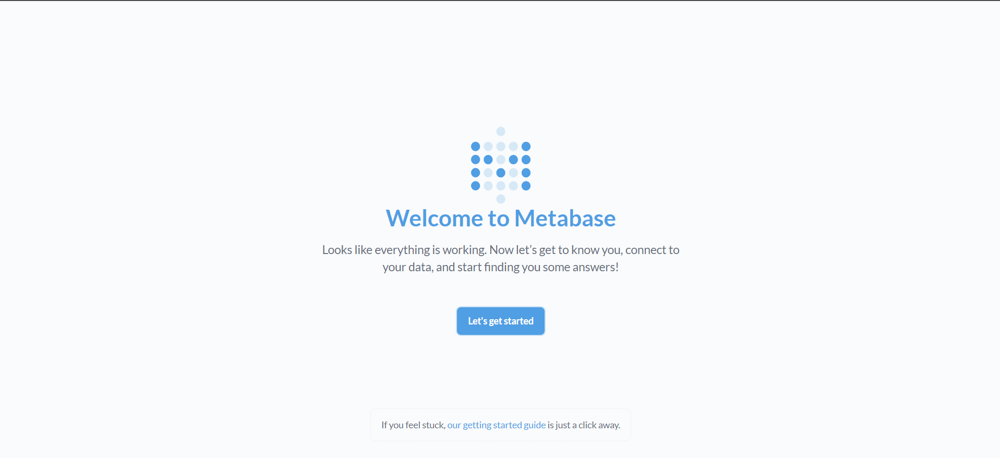
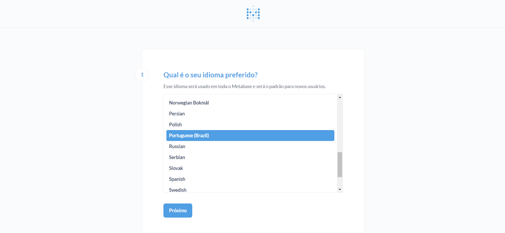
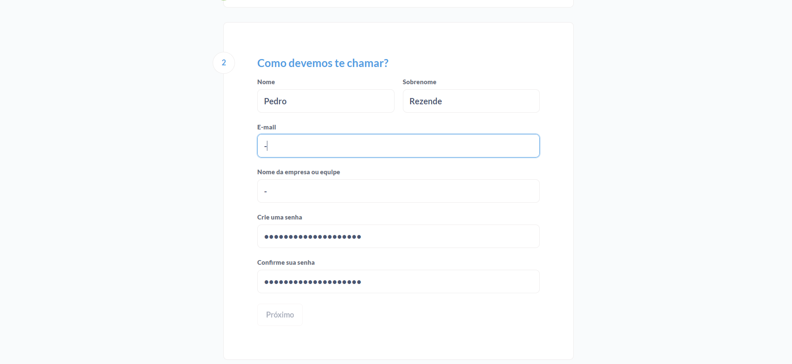
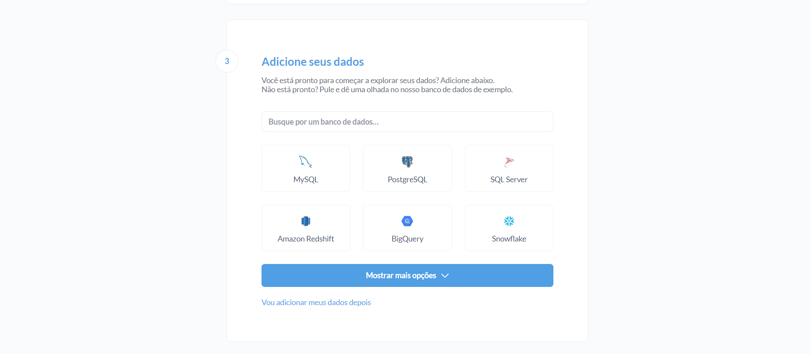
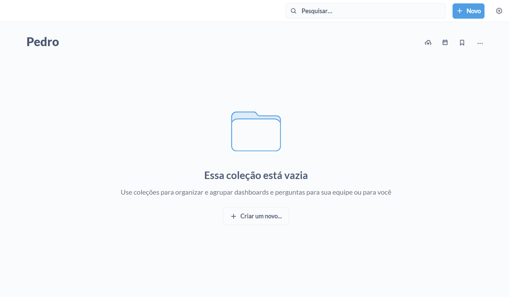
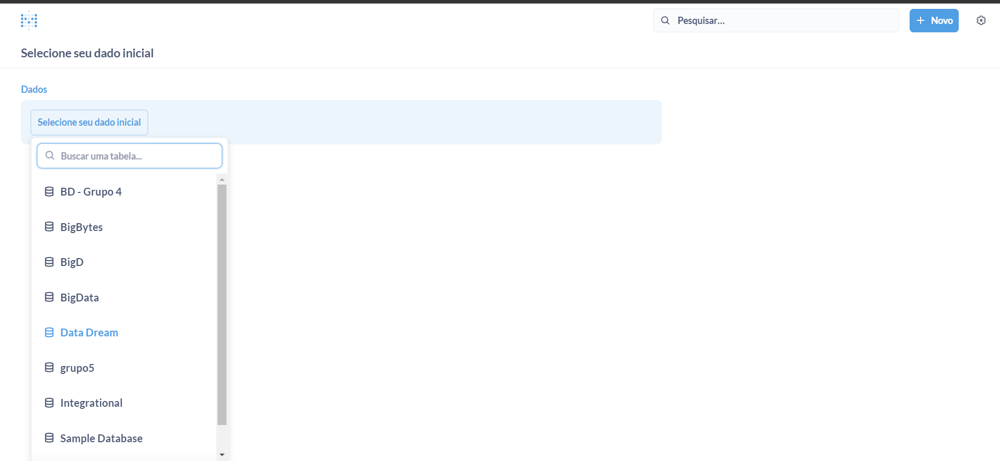
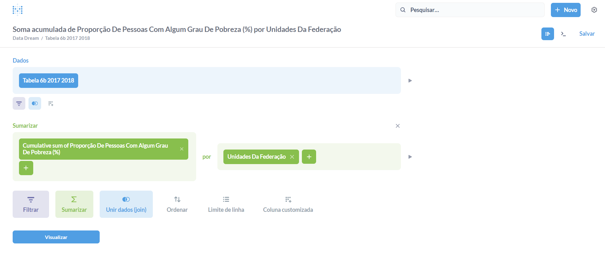
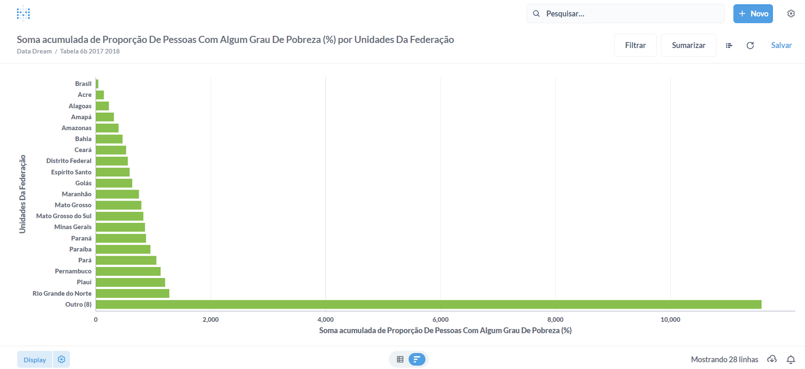

# Atividade de Criação de Data Visualization com Metabase, Grafana ou Power BI

## Sumário
[1. Objetivo ](#c1)<br>
[2. Descrição das Ferramentas e Escolha ](#c2)<br>
[3. Configuração da Ferramenta](#c3) <br>
[4. Criação de gráficos no Metabase](#c4)<br>
[5. Análise dos dados](#c5)<br>

#### **Barema**:

- Escolha e justificativa da ferramenta de visualição de dados (Metabase, Grafafa ou PowerBI) para o projeto;
- Configuração correta da ferramenta escolhida para importar e processar os dados;
- Desenvolvimento de um dashboard ou visualização de dados que represente de forma eficaz as informações do dataset;
- Aplicação de técnicas adequadas de visualização para facilitar a interpretação e análise dos dados;
- Documentação completa da visualização, incluindo legenda, rótulos e uma interpretação clara dos dados apresentados;
- Explicação detalhada no readme do processo de escolha da ferramenta, configuração, criação da visualização e análise dos dados;
- A clareza e precisão na documentação e explicação serão avaliadas. Erros ortográficos e gramaticais serão penalizados, com desconto de até 20% dos pontos;

## <a name="c1">Objetivo</a>

O principal objetivo desta atividade de Visualização de Dados é fornecer uma representação visual eficaz e interpretável das informações contidas no conjunto de dados selecionado. Busco explorar as potencialidades de ferramentas de visualização, como Metabase, Grafana ou PowerBI, para apresentar insights valiosos que possam ser utilizados na tomada de decisões informadas. Tendo isso em vista, irei passar por todo o processo de escolha da ferramenta, configuração, criação da visualização e análise dos dados, como descrito no barema da atividade.

## <a name="c2">Descrição das Ferramentas e Escolha</a>

Para a escolha da ferramenta de visualização de dados tive que considerar diferentes aspectos, como a natureza dos dados, a facilidade de uso, a capacidade de personalização, a integração com outras ferramentas, entre outros. Sendo assim, realizei uma análise comparativa entre as ferramentas Metabase, Grafana e PowerBI, que são as mais populares e utilizadas no mercado. A seguir, apresento uma breve descrição de cada uma delas, de forma comparativa, com objetivo de esclarecer o processo de escolha.


O Metabase destaca-se como uma ferramenta de inteligência de negócios (BI) reconhecida por sua implementação ágil e facilidade de uso. Sua proposta é permitir que até mesmo usuários sem conhecimento avançado em SQL construam gráficos e obtenham insights por meio de uma interface amigável. Seu construtor de consultas visuais simplifica a criação de filtros, gráficos e dashboards, tornando a análise de dados acessível a todos. Além disso, o Metabase oferece a capacidade de construir modelos semânticos enriquecidos, promovendo consultas consistentes e eficientes.

O Metabase, como ferramenta de business intelligence de código aberto, vai além da simplicidade ao oferecer recursos avançados. Os administradores podem compartilhar painéis em tempo real, aprimorando o desempenho com insights detalhados apresentados em tabelas e gráficos de barras. O editor de notebook integrado e a compatibilidade com SQL possibilitam às equipes obter respostas conforme sua conveniência, ampliando a visualização com assinaturas, tabelas dinâmicas e variáveis em consultas interativas. A integração ativa com diversos bancos de dados externos, como MySQL, Amazon Redshift e outros, amplia ainda mais a versatilidade do Metabase.


O Grafana é uma plataforma de código aberto conhecida por sua flexibilidade e ampla aplicação, especialmente em monitoramento de operações de TI. Sua versatilidade é evidenciada pela integração fácil com diversas fontes de dados, como Prometheus, InfluxDB e Elasticsearch. O Grafana proporciona uma interface altamente personalizável, permitindo aos usuários criar painéis detalhados e atraentes para análises visuais abrangentes. Sua abordagem única de unificar dados de várias fontes em um único painel sem centralização fornece uma visão panorâmica, quebrando barreiras de dados. Além disso, a capacidade de compartilhamento de painéis fomenta a colaboração e a transparência nas equipes.

Grafana expande ainda mais sua utilidade, atendendo às necessidades de monitoramento em diversas áreas, desde métricas do Prometheus até registros, aplicativos e fontes de dados personalizadas. A plataforma Grafana Cloud oferece uma solução altamente disponível e gerenciada para coletar, analisar e alertar sobre métricas Graphite e Prometheus, bem como logs Loki. O Grafana Enterprise, com seus plug-ins corporativos, proporciona aos usuários acesso facilitado a fontes de dados existentes, otimizando a visualização de dados em soluções complexas e caras de monitoramento.


O Microsoft Power BI se destaca como uma plataforma de visualização de dados projetada para criar uma cultura orientada a dados e impulsionar a inteligência de negócios. A ferramenta facilita a criação e o compartilhamento de visualizações de dados avançadas, apoiando a tomada de decisões baseadas em dados. Sua interface empresarial simplificada torna a análise acessível a usuários com diferentes níveis de habilidade técnica. A integração com diversas fontes de dados e ferramentas, incluindo o Microsoft Excel, oferece flexibilidade aos usuários.

Power BI vai além, proporcionando uma governança robusta e recursos avançados de proteção de dados. Permite a aplicação de rótulos de confidencialidade reconhecíveis por meio de aplicativos do Office 365, garantindo conformidade com regulamentações e políticas de privacidade. Os usuários podem supervisionar dados confidenciais usando o Microsoft Cloud App Security, estendendo políticas de governança e proteção. A Proteção de Informações da Microsoft permite bloquear atividades arriscadas em tempo real, assegurando a confidencialidade dos dados. Além disso, o Power BI oferece recursos de aprendizado online para rápida adoção e disseminação do conhecimento na organização.

### Comparação técnica entre as ferramentas

Agora que temos uma noção de como cada uma das ferramentas funcionam, vamos fazer uma análise comparativa entre elas, considerando alguns aspectos importantes para a escolha da ferramenta de visualização de dados, com base nas necessidades da nossa atividade. A fonte que está sendo utilizada é do site 
<a href="https://www.saasworthy.com/compare/microsoft-power-bi-vs-grafana-vs-metabase?pIds=5042,5906,10031">"SaaSworthy"</a> - aqui você consegue acessar diretamente para a comparação técnica entre as 3 ferramentas.


### Escolha da Ferramenta

Após a análise comparativa entre as ferramentas, decidi escolher o **Metabase** para a realização da atividade de Visualização de Dados. A escolha foi baseada em alguns aspectos, como a facilidade de uso, a capacidade de personalização, a integração com outras ferramentas, entre outros. Porém, para destacar essa escolha, vou apresentar três pontos principais que me fizeram escolher o Metabase:

1. **Facilidade de uso**: O Metabase é uma ferramenta de visualização de dados que possui uma interface amigável e intuitiva, que permite que até mesmo usuários sem conhecimento avançado em SQL construam gráficos e obtenham insights por meio de uma interface amigável. Seu construtor de consultas visuais simplifica a criação de filtros, gráficos e dashboards, tornando a análise de dados acessível a todos. Além disso, o Metabase oferece a capacidade de construir modelos semânticos enriquecidos, promovendo consultas consistentes e eficientes.

2. **Precificação**: O Metabase é uma ferramenta de visualização de dados de código aberto, ou seja, é gratuito. Isso foi um fator decisivo para a escolha, pois não precisarei pagar nada para utilizar a ferramenta e realizar a atividade de Visualização de Dados.

3. **Já ter utilizado a ferramenta**: Já tive a oportunidade de utilizar o Metabase em um projeto de Data Visualization, onde tive que criar um dashboard para um cliente. Sendo assim, já tenho uma certa familiaridade com a ferramenta, o que facilitará o processo de criação da visualização de dados.

## <a name="c3">Configuração da Ferramenta</a>

 

### Passo 1: Confirmação do WSL2 e Docker Desktop
- Para seguir com esse tutorial, é necessário fazer a confirmação de que o WSL2 e o Docker Desktop estão instalados e funcionando corretamente. 
    - Recomendo a leitura do tutorial <a href="https://github.com/codeedu/wsl2-docker-quickstart">"wsl2-docker-quickstart"</a> para a instalação e configuração do WSL2 e Docker Desktop. 

### Passo 2: Instalação do Metabase via Docker
- Após a confirmação do WSL2 e Docker Desktop, vamos instalar o Metabase via Docker. Para isso, será necessário inicializar o Docker Desktop e abrir o seu terminal. Clique na tecla Windows () e digite "CMD" para abrir o terminal do Windows.

1. No terminal, digite o seguinte comando para baixar a imagem mais recente do Metabase via Docker:
    ```bash
    docker pull metabase/metabase:latest
    ```
2. Após o download da imagem, digite o seguinte comando para criar um container do Metabase:
    ```bash
    docker run -d -p 3000:3000 --name metabase metabase/metabase
    ```
3. Para verificar se o container está rodando, digite o seguinte comando:
    ```bash
    docker ps
    ```
    - Se o container estiver rodando, você verá uma saída semelhante a essa:
        ```bash
        CONTAINER ID   IMAGE                 COMMAND                  CREATED          STATUS          PORTS                                       NAMES
        4b8b8b8b8b8b   metabase/metabase     "/app/run_metabase.sh"   10 minutes ago   Up 10 minutes
        ```

### Passo 3: Acessando o Metabase
- Para acessar o Metabase, abra o seu navegador e digite na URL (barra de pesquisa do navegador) o seguinte endereço <a href= "http://localhost:3000">"http://localhost:3000"</a>.

## <a name="c4">Criação de gráficos no Metabase</a>

### Abrindo o MetaBase

- Acesso à interface do Metabase


- Configurando a linguagem a ser utilizada


- Configure sua conta com login e senha para acessar o Metabase


- Escolha do tipo de banco de dados a ser utilizado


#### Configuração do banco de dados

- Como é possível ver, o Metabase possui uma grande variedade de bancos de dados que podem ser utilizados. Para essa atividade, irei utilizar o banco de dados do Redshift, que é um banco de dados de data warehouse baseado em nuvem, que faz parte da família de produtos de serviços de nuvem da Amazon Web Services (AWS). Para efetuar essa conexão irei utilizar a conta do Metabase da turma de Sistemas da Informação, que já possui uma variedade de base de dadas tratadas.

- Caso queira fazer acesso a outro banco de dados, de forma a acessar outros dados, irei deixar o link do tutorial de uma colega que fez a conexão manual: <a href="https://github.com/furlan2803/Grafico_Pipeline_Metabase/blob/main/README.md#acessando-o-metabase">"Tutorial Metabase - Giovanna Furlan"</a>.

- Outro requisito, após a conexão com o banco de dados do Redshift, também é a importação de seus dados para o Metabase. Para isso, irei disponibilizar o link do tutorial de um colega que fez o passo a passo da importação desses dados: <a href="https://github.com/Lucasx369/Modulo-8/tree/main/Atividade%205#importar-dados-do-amazon-redshift">"Tutorial Metabase - Lucas Vieira"</a>.

Tendo em vista todos esses aspectos, vamos para a criação dos gráficos.

### Criação dos gráficos

- Após você ter feito a conexão com o banco de dados e a importação dos dados, você irá acessar a opção "Novo" e depois em "Pergunta" para criar os gráficos.


- Após isso, temos que selecionar qual será o banco de dados que iremos utilizar para a criação dos gráficos. Irei selecionar o banco de dados `DataDream` e a base `tabela 6b 2017 2018` - que demonstra a situação da população brasileira, a partir de diversos aspectos.


- Depois de selecionar que dados iremos utilizar, temos que selecionar o que queremos ver com esses dados. Então, precisamos sumarizar os dados, para que possamos ter uma visão geral deles. Para isso, irei selecionar a opção "Sumarizar" e depois "Soma acumulativa" da coluna de Proporção de pessoas com algum Grau de Pobreza (%) por UF.


- Assim, nosso gráfico final fica da seguinte forma:


## <a name="c5"> Análise dos dados </a>

- O porquê de eu ter selecionado tal base para a contrução desse gráfico, era para visualizar alguns dos estados que possuem maior proporção de nível de grau de pobreza. 
- Como é possível analisar, o estado do Rio Grande do Norte possui a maior proporção de pessoas com algum grau de pobreza.
- Porém, uma possível falha a se apresentar nesse gráfico, seria a encapsulação de 8 outros estados, que possuem uma proporção de pessoas com algum grau de pobreza maior que 50%. Sendo assim, a visualização desses estados fica prejudicada, pois não conseguimos visualizar a proporção de pessoas com algum grau de pobreza de cada um deles. Além do fato de que eles concentram essa proporção em uma única divisória, chamada 'Outros'.